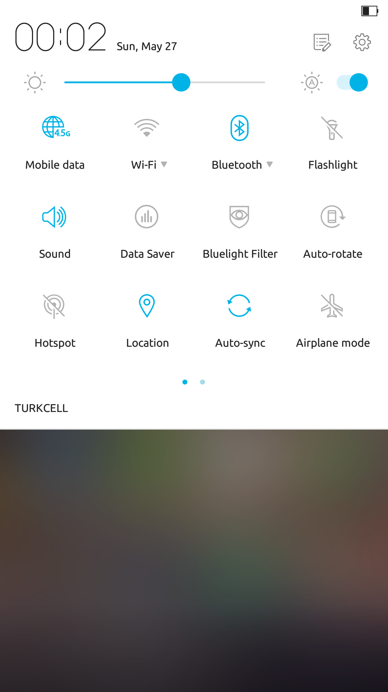
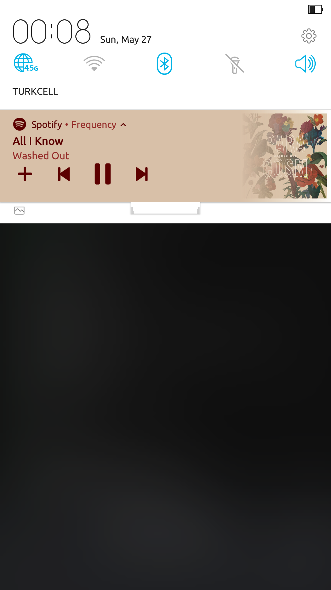

## Ubuntu Font Family for Android
This is a modified version of Ubuntu Regular True Type Font for Android Ecosystem. It is, as tested for 1 year (personal use), fully compatible with Android devices and does not misalign, misplace shown text. Currently, Latin symbols are 100% okay, Cryrilic was tested and did not seem to have any problem.

I used Roboto Regular font as the base. FontForge and FontCreator were the programs, I edited this font with.   

## Downloads
[Download as TTF file](Ubuntu Font.ttf) or [FlipFont APK (Samsung, ASUS)](Ubuntu Font_FlipFont.apk)

## Screenshots

This font to comply the requirement of the source font, Ubuntu Font Family, is licenced under Ubuntu Font Licence, which can be found at https://www.ubuntu.com/legal/terms-and-policies/font-licence
